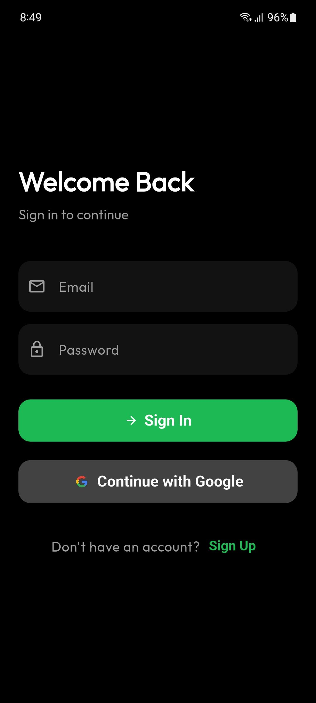
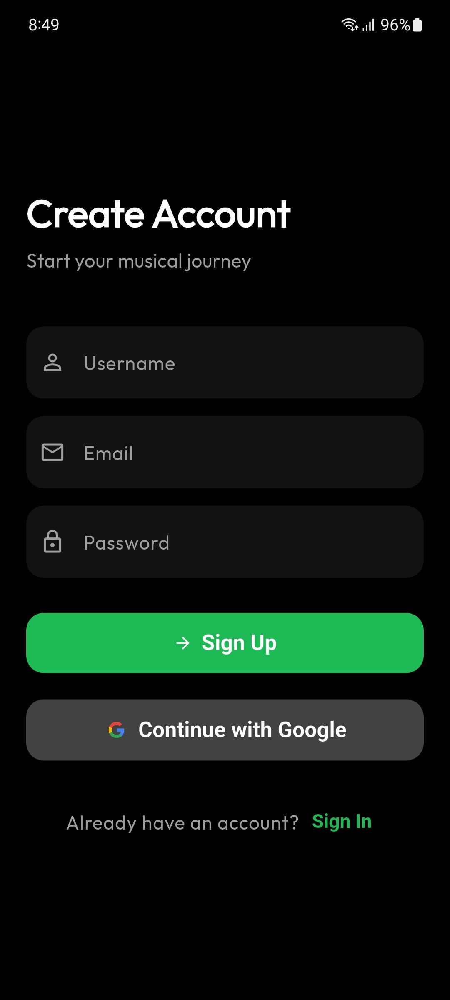
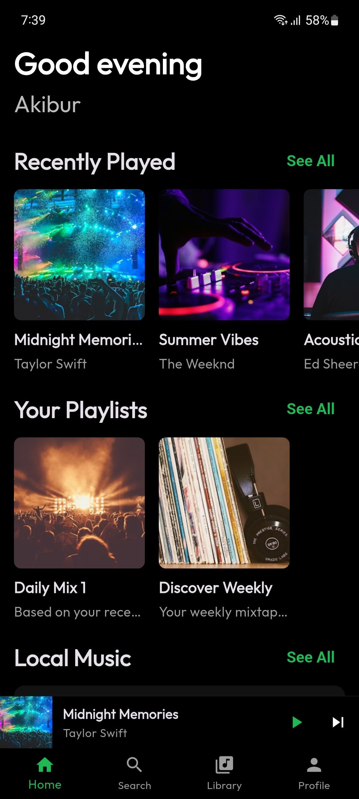
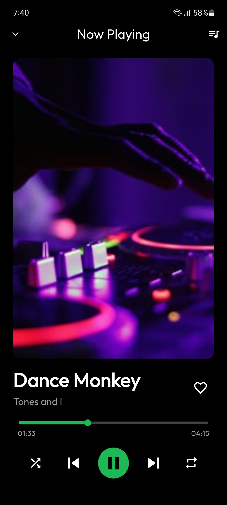
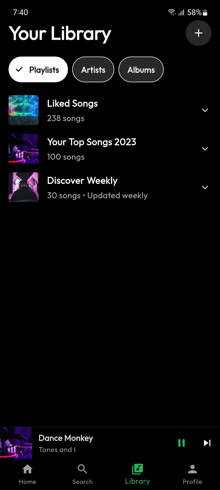
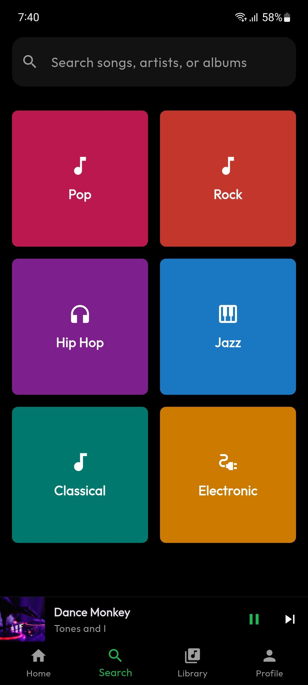
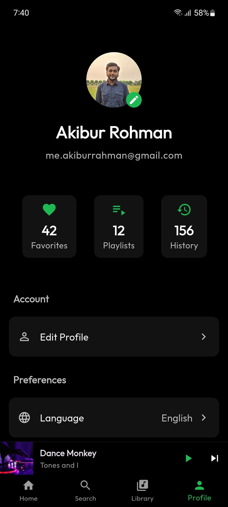
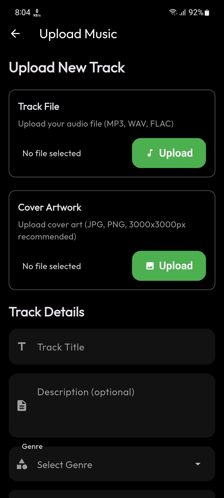

# Auracle

A modern music streaming application built with Flutter, featuring a beautiful dark theme UI and seamless user experience.


## 🌟 Features

- 🎨 Beautiful dark theme UI with smooth animations
- 🔐 Secure authentication system
  - Email/Password login
  - Google Sign-in integration
  - Secure session management
- 🎵 Music Player
  - Play/Pause functionality
  - Next/Previous track controls
  - Progress bar with seek functionality
  - Volume control
- 📱 Responsive design that works on all screen sizes
- 🔄 Real-time data synchronization
- 🌐 Cross-platform support (Android, iOS, Web)

## 📸 Screenshots

### Authentication Screens
<table>
<tr>
<td></td>
<td></td>
</tr>
</table>

### Main App Screens
<table>
<tr>
<td></td>
<td></td>
<td></td>
</tr>
<tr>
<td></td>
<td></td>
<td></td>
</tr>
</table>

## 🚀 Getting Started

### Prerequisites

- Flutter SDK (latest stable version)
- Dart SDK (latest stable version)
- Android Studio / VS Code with Flutter extensions
- Firebase account
- Git

### Installation

1. Clone the repository:
   ```bash
   git clone https://github.com/yourusername/auracle.git
   cd auracle
   ```

2. Install dependencies:
   ```bash
   flutter pub get
   ```

3. Configure Firebase:
   - Create a new Firebase project
   - Add Android and iOS apps to your Firebase project
   - Download and add the configuration files:
     - `google-services.json` for Android
     - `GoogleService-Info.plist` for iOS
     - `firebase_options.dart` for Flutter

4. Run the app:
   ```bash
   flutter run
   ```

## 🏗️ Architecture

This project follows a clean architecture pattern with feature-first organization:

```
lib/
├── core/
│   ├── constants/
│   ├── theme/
│   ├── router/
│   └── utils/
├── features/
│   ├── auth/
│   │   ├── presentation/
│   │   ├── domain/
│   │   └── data/
│   ├── player/
│   │   ├── presentation/
│   │   ├── domain/
│   │   └── data/
│   └── profile/
│       ├── presentation/
│       ├── domain/
│       └── data/
└── main.dart
```

## 🛠️ Tech Stack

- **Frontend Framework**: Flutter
- **State Management**: Riverpod
- **Navigation**: GoRouter
- **Backend**: Firebase
  - Authentication
  - Cloud Firestore
  - Cloud Storage
- **UI Components**: 
  - Flutter Material Design
  - Custom animations
  - Responsive layouts
- **Development Tools**:
  - Flutter Hooks
  - Freezed for immutable state
  - JSON Serializable
  - Build Runner

## 📱 Platform Support

- Android (API level 21+)
- iOS (iOS 11.0+)
- Web (Chrome, Firefox, Safari)

## 🤝 Contributing

1. Fork the repository
2. Create your feature branch (`git checkout -b feature/AmazingFeature`)
3. Commit your changes (`git commit -m 'Add some AmazingFeature'`)
4. Push to the branch (`git push origin feature/AmazingFeature`)
5. Open a Pull Request

## 📄 License

This project is licensed under the MIT License - see the [LICENSE](LICENSE) file for details.

## 👥 Authors

- Your Name - Initial work - [YourGitHub](https://github.com/yourusername)

## 🙏 Acknowledgments

- Flutter team for the amazing framework
- Firebase team for the backend services
- All contributors who have helped shape this project
